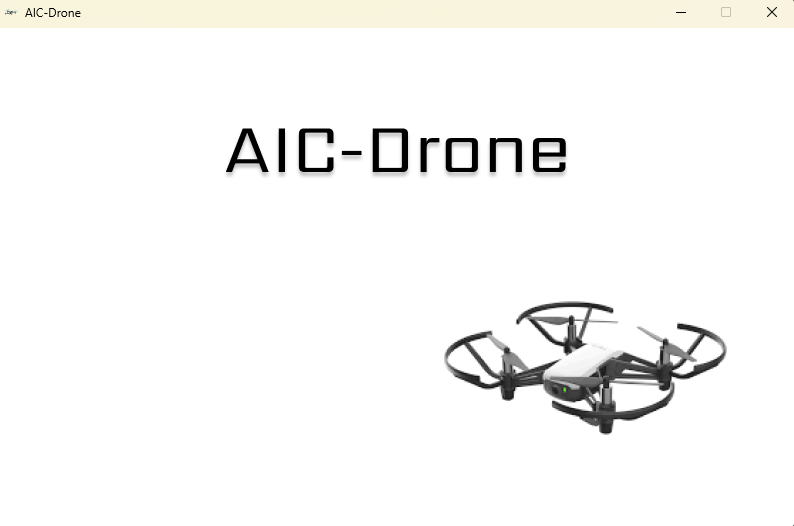
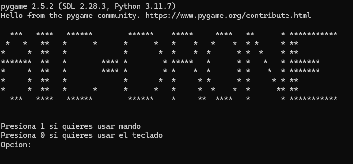
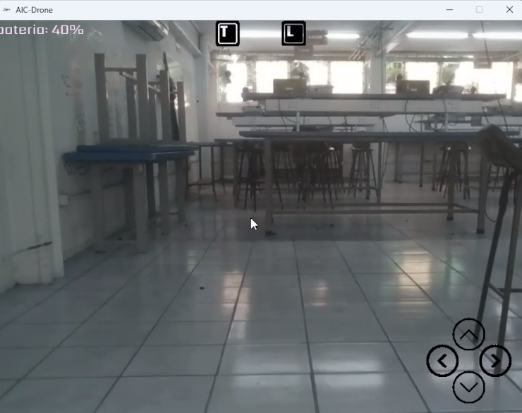
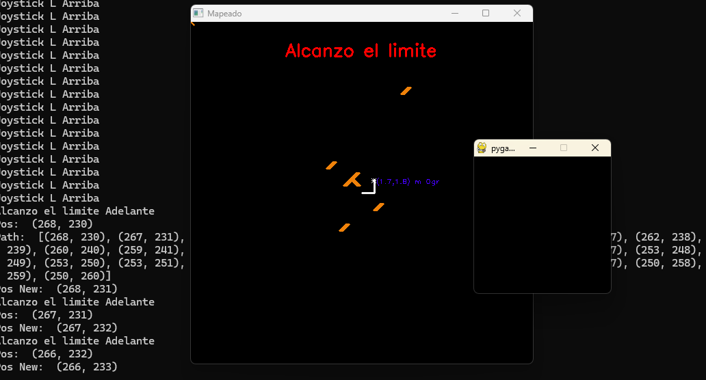

# AIC-DRONE

Este proyecto esta enfocado en automatizar un dron de tal manera que si este llega a perder la señal 
en algun punto pueda retornar un poco para que de esta manera se logre evitar que el dron
se salga de control o cause algun accidente.

La aplicacion cuenta con 2 ventanas. La primera es el dron; en esta se mostrara la camara asi como los controles en pantalla.

## Ventana para usar teclado o mando
Esta es una venta sencilla de consola en la cual se elije una opcion para usar el teclado como control
o si se tiene algun mando (Xbox) se pueda utilizar este, de igual manera cuenta con su configuracion en
los botones.

## Ventana de Dron
En esta primera se visualiza una ventana en la cual una vez el dron se logra conectar con el dispositivo
por medio de su red este enciende la camara y muestra una interfaz en la cual se muestra informacion
acerca del dron y sus controles, como por ejemplo, la bateria restante del dron o en el dado caso
que se utilice mando para controlar el dron, el nombre del dispositivo que lo controla. Tambien se puede 
apreciar los botones de vuelo que este tiene.
Los controles que se aprecian son:
- Tecla **T** = *Despegar*
- Tecla **L** = *Aterrizar*
- Fecla **Arriba** = *Avanzar hacia adelante*
- Fecla **Abajo** = *Avanzar hacia atras*
- Fecla **Izquierda** = *Avanzar hacia la izquierda*
- Fecla **Derecha** = *Avanzar hacia la derecha*

Existen tambien teclas para otras funciones como lo son:
- Tecla **a** = *Girar a la izquierda*
- Tecla **d** = *Girar a la derecha*
- Tecla **w** = *Elevar el dron*
- Tecla **s** = *Descender el dron*
- Tecla **f** = *Tomar foto*
- Tecla **e** = *Terminar programa*

### Controles de mando
Los controles si cuentas con un mando de Xbox son los siguientes:
- Boton **Y** = *despegue*
- Boton **X** = *aterrizaje*
- Boton **B** = *encender o apagar camara (no usar de preferencia)*
- Boton **RB** = *foto (probar para ver si funciona)*
- Boton **Joystick izquierdo** = *movimiento dron*
- Boton **Joystick derecho** = *giros y elevaciones*
- Boton **Pause** = *acabar el programa*
- Boton **Select** = *desconectar el dron*

## Ventana de Mapeado
La segunda es un mapeado en el cual se muestra la trayectoria del dron asi como las coordenadas de su posicion, tambien una vez alcanzado el limite permitido de distancia se muestra un mensaje asi como el sonido de una alarma dandole a entender al usuario que está alcanzando la distancia máxima, de igual manera si el usuario decide continuar es donde entra en accion el algoritmo.
De igual manera en consola se puede ver las coordenadas que por medio del algoritmo D*Lite logra hacer
para encontrar el camino mas optimo en caso de haber obstaculos. 
